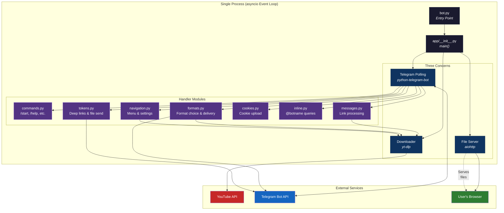
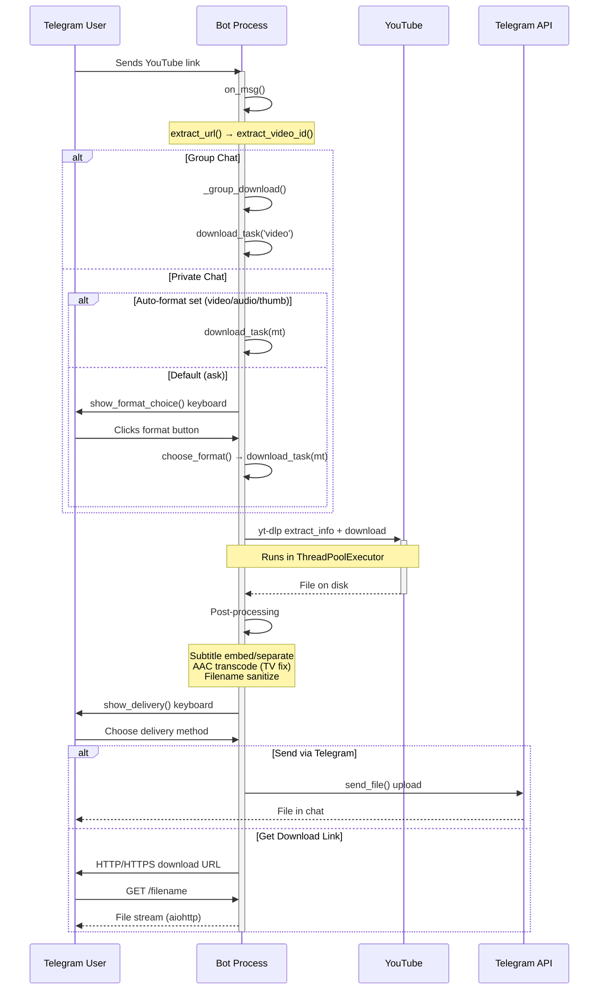
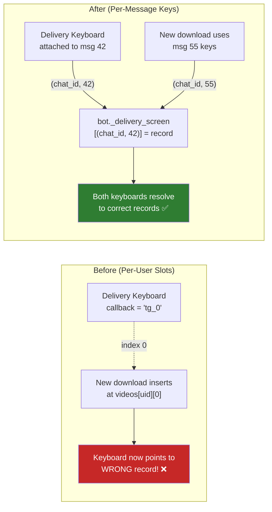
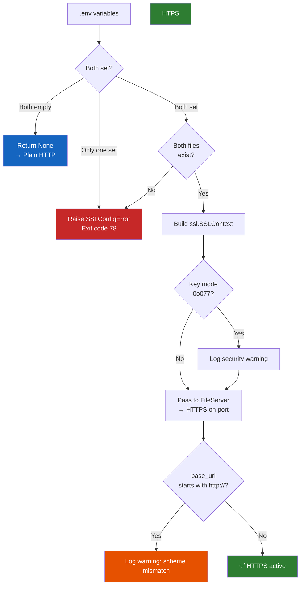
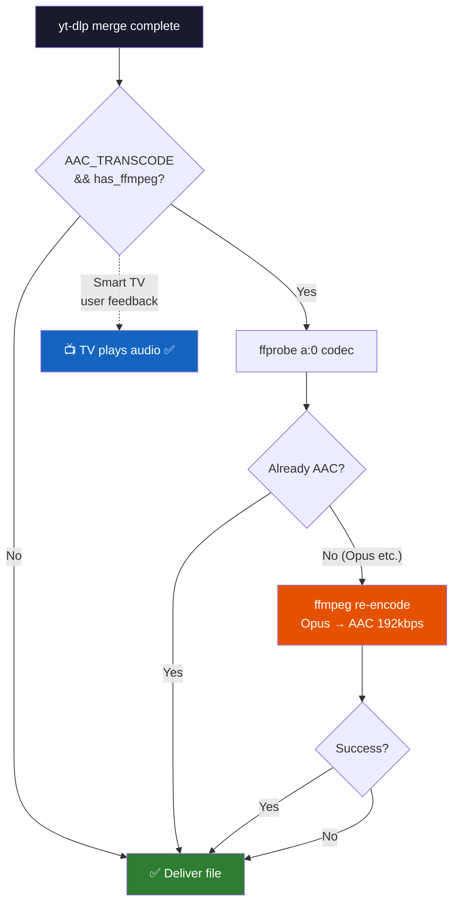
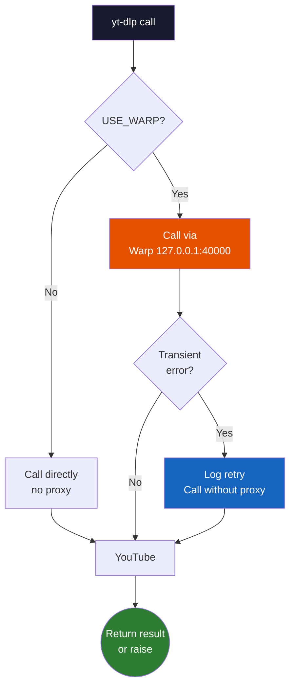
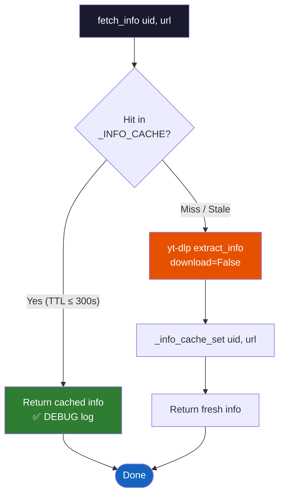
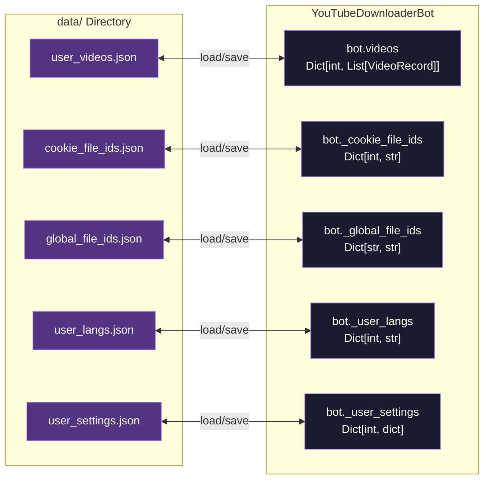
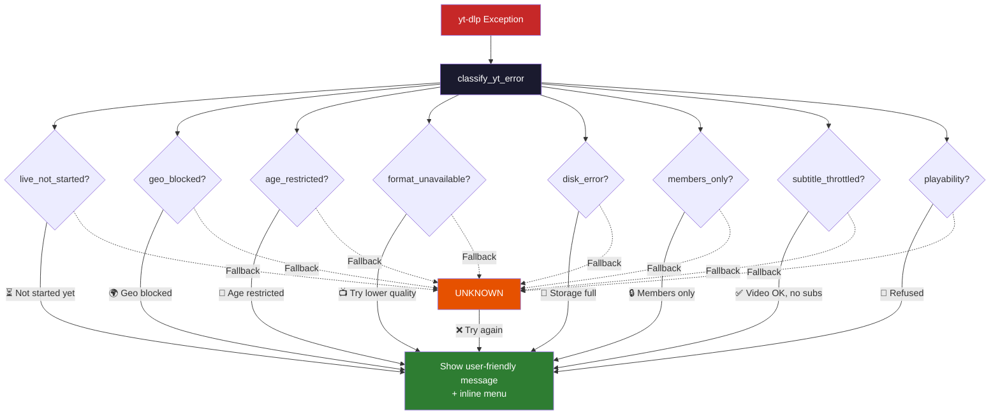

# Architecture Guide

> **Understanding the Telegram YouTube Downloader Bot codebase**

---

## Table of Contents

- [High-Level Overview](#high-level-overview)
- [Package Structure](#package-structure)
- [Data Flow](#data-flow)
- [Key Design Decisions](#key-design-decisions)
- [State Management](#state-management)
- [Threading & Concurrency](#threading--concurrency)
- [Error Handling Patterns](#error-handling-patterns)

---

## High-Level Overview

The bot is a **single-process Python application** that combines three concerns:

1. **Telegram Bot API** (polling + responding) via `python-telegram-bot` v20.x
2. **YouTube downloading** via `yt-dlp` (run in a thread pool executor)
3. **HTTP file serving** via `aiohttp` (run in the same event loop)

All three run in one process — no separate file server, no reverse proxy needed (though supported).



---

## Package Structure

```
Telegram_Yt_Bot/
├── bot.py                   # Entry point (calls app.main())
├── config.py                # Environment config parser
├── serve_files.py           # Standalone HTTP server (alternative)
│
├── app/
│   ├── __init__.py          # Bootstrap: logging, wiring, main()
│   ├── bot.py               # YouTubeDownloaderBot (central state)
│   ├── downloader.py        # yt-dlp sync functions
│   ├── fileserver.py        # aiohttp async file server
│   ├── models.py            # VideoRecord data class
│   └── utils.py             # Shared utilities, constants, error classification
│
├── app/handlers/
│   ├── __init__.py          # Package marker
│   ├── commands.py          # /start, /help, /status, /recent, /settings, /cancel
│   ├── cookies.py           # /cookies conversation handler
│   ├── formats.py           # Format-choice & delivery keyboards
│   ├── inline.py            # @botname inline queries
│   ├── messages.py          # Plain-text YouTube link processing
│   ├── navigation.py        # Menu system, back-stack, settings UI
│   └── tokens.py            # Deep-link tokens & file delivery
│
├── tests/                   # Unit tests
├── docs/                    # Documentation
├── data/                    # Persistent JSON state
└── downloads/               # Downloaded media files
```

### Module Responsibilities

| Module | Role | Key Classes/Functions |
|--------|------|----------------------|
| `app/__init__.py` | Bootstrap | `main()`, `WAITING_FOR_COOKIES` |
| `app/bot.py` | Central state | `YouTubeDownloaderBot`, `SSLConfigError`, `_build_ssl_context()` |
| `app/downloader.py` | YouTube downloads | `download()`, `fetch_info()`, `download_thumb()`, `_merge_subs_into_mkv()` |
| `app/fileserver.py` | HTTP server | `FileServer`, `_AiohttpNoiseFilter` |
| `app/models.py` | Data model | `VideoRecord` |
| `app/utils.py` | Utilities | `esc()`, `extract_url()`, `classify_yt_error()` |
| `handlers/commands.py` | Slash commands | `start_cmd`, `help_cmd`, `status_cmd` |
| `handlers/formats.py` | Delivery flow | `show_delivery()`, `format_choice_kb()`, `send_telegram()` |
| `handlers/navigation.py` | Menu system | `router()`, `show_recent()`, `settings_menu()` |
| `handlers/tokens.py` | Deep links | `handle_token_start()`, `send_file()` |

---

## Data Flow

### User Downloads a Video



### State Persistence Flow

```mermaid
flowchart TD
    START(["Bot Starts"]) --> INIT[YouTubeDownloaderBot.__init__]
    
    INIT --> LOAD[load_data]
    
    subgraph "Startup Loading"
        LOAD --> UV[user_videos.json<br/><i>Per-user VideoRecord list</i>]
        LOAD --> CF[cookie_file_ids.json<br/><i>Telegram file_ids for cookies</i>]
        LOAD --> GF[global_file_ids.json<br/><i>Cross-user file_id cache</i>]
        LOAD --> UL[user_langs.json<br/><i>Language preferences</i>]
        LOAD --> US[user_settings.json<br/><i>Quality, delivery, etc.</i>]
    end
    
    INIT --> CLEAN[_cleanup_orphans]
    
    subgraph "Startup Cleanup"
        CLEAN --> SWEEP1[Remove .ytdl / .part fragments]
        CLEAN --> SWEEP2[Remove files > STORAGE_DAYS old<br/>that aren't pinned in videos[] ]
        CLEAN --> LOG[Log bytes freed]
    end
    
    CLEAN --> RUNNING[Bot is Running]
    
    RUNNING --> HANDLER[Handler mutates state]
    HANDLER --> SAVE[bot.save]
    SAVE --> WRITE[Write all 5 JSON files]
    WRITE --> RUNNING
    
    RUNNING -.-> CRASH([Process killed])
    CRASH -.-> START
    
    style START fill:#2e7d32,color:#fff
    style RUNNING fill:#1565c0,color:#fff
    style CRASH fill:#c62828,color:#fff
    style INIT fill:#1a1a2e,color:#fff
    style LOAD fill:#533483,color:#fff
    style CLEAN fill:#533483,color:#fff
    style SAVE fill:#e65100,color:#fff
```

---

## Key Design Decisions

### 1. Per-Message State (2026-07-15 Fix)

**Problem**: Previously, the bot used per-user slots (`bot.videos[uid]` + index-based callbacks). Starting a second download before clicking the first delivery button would overwrite the first download's keyboard mapping.

**Solution**: All ephemeral state is now keyed by `(chat_id, message_id)`:

- `bot._delivery_screen[(chat_id, msg_id)] = VideoRecord`
- `bot._pending_urls[(chat_id, msg_id)] = (url, video_id, ...)`
- `bot._nav_stack[(chat_id, msg_id)] = [entry, ...]`

Bounded by an `OrderedDict` LRU cap (1024 entries) to prevent memory leaks.



### 2. Native HTTPS Without Reverse Proxy

The bot can terminate TLS itself using `aiohttp`'s `ssl_context` parameter:

- `SSL_CERT_FILE` and `SSL_KEY_FILE` env vars point to PEM files
- `_build_ssl_context()` validates and constructs an `ssl.SSLContext`
- On misconfiguration, bot exits with code 78 (`EX_CONFIG`) — systemd does NOT restart-loop



### 3. AAC Transcode (TV Fix, 2026-06-21)

Many smart TVs lack Opus hardware decoders. The bot optionally transcodes Opus → AAC (192kbps) after download:

- `AAC_TRANSCODE=true` (default) enables the transcode
- `_probe_audio_codec()` skips the transcode if audio is already AAC
- Cost: ~30-90s on a single-core VPS for Opus-source videos



### 4. Warp Proxy Integration (2026-06-26)

When `USE_WARP=true`, yt-dlp routes through Cloudflare Warp (`127.0.0.1:40000`). On transient connection errors, it retries once without the proxy so downloads succeed when Warp is temporarily down.



### 5. yt-dlp Info Cache (2026-06-28)

`fetch_info` results are cached per `(uid, url)` with a 300-second TTL. This prevents repeated YouTube round-trips when the user bounces between `show_format_choice` and the delivery keyboard.



---

## State Management

### Persistent State (JSON files in `data/`)



### Ephemeral State (memory only, bounded LRU)

| Structure | Key Type | Max Size | Purpose |
|-----------|----------|----------|---------|
| `_delivery_screen` | `(chat_id, message_id)` | 1024 | Delivery keyboard → VideoRecord |
| `_pending_urls` | `(chat_id, message_id)` | 1024 | Format picker → URL |
| `_nav_stack` | `(chat_id, message_id)` | 1024 | Menu navigation back-stack |
| `_tokens` | `str` (token) | Unbounded | Deep-link tokens (cleaned on use) |
| `_INFO_CACHE` | `(uid, url)` | 1000 | yt-dlp info cache (300s TTL) |

```mermaid
flowchart TD
    subgraph "OrderedDict LRU (max 1024)"
        DIRECTION TB
        E1["(chat: 100, msg: 42) → Record{...}"]
        E2["(chat: 100, msg: 55) → Record{...}"]
        E3["(chat: 200, msg: 12) → Record{...}"]
        DOT["... (up to 1024 entries)"]
    end
    
    CLICK[User clicks button] --> LOOKUP["bot._delivery_screen.get((cid, mid))"]
    LOOKUP --> FOUND{FOUND?}
    FOUND -->|"Yes + file on disk"| MOVE[LRU move_to_end]
    MOVE --> SERVE[Deliver file ✅]
    FOUND -->|"Yes + gone"| POP[Pop entry]
    POP --> UNAVAIL[Show 'no longer available' ❌]
    FOUND -->|"No"| UNAVAIL
    
    NEW[New delivery screen] --> PUT["_delivery_screen[key] = record<br/>move_to_end(key)"]
    PUT --> FULL{len > 1024?}
    FULL -->|"Yes"| EVICT["popitem(last=False)<br/>evict oldest"]
    FULL -->|"No"| DONE2(["Done"])

    style E1 fill:#1a1a2e,color:#fff,stroke:#16213e
    style E2 fill:#1a1a2e,color:#fff,stroke:#16213e
    style E3 fill:#1a1a2e,color:#fff,stroke:#16213e
    style DOT fill:#1a1a2e,color:#aaa
    style SERVE fill:#2e7d32,color:#fff
    style UNAVAIL fill:#c62828,color:#fff
    style EVICT fill:#e65100,color:#fff
```

---

## Threading & Concurrency

```mermaid
flowchart TB
    subgraph "Main Thread — asyncio Event Loop"
        direction TB
        POLL[Telegram Polling<br/><i>python-telegram-bot</i>]
        AHTTP[aiohttp File Server<br/><i>Range requests</i>]
        HANDLERS[Handler Coroutines<br/><i>commands, menus, etc.</i>]
        SEM[Download Semaphore<br/><i>asyncio.Semaphore(1)</i>]
        
        POLL & AHTTP & HANDLERS --- EVENT[Event Loop]
    end

    subgraph "Thread Pool — run_in_executor"
        direction TB
        DL[download()<br/><i>yt-dlp sync</i>]
        INF[fetch_info()<br/><i>yt-dlp sync</i>]
        SUB[_run_sync()<br/><i>subprocess.run</i>]
    end

    GATHER[asyncio.gather<br/><i>for /status probes</i>]

    HANDLERS --> |"Acquire"| SEM
    SEM --> |"Release"| DL
    HANDLERS --> INF
    HANDLERS --> GATHER
    
    DL --> SUB
    
    GATHER --> P1[warp-cli status]
    GATHER --> P2[socket probe port 40000]
    GATHER --> P3[systemctl is-active]

    style POLL fill:#0f3460,color:#fff
    style AHTTP fill:#0f3460,color:#fff
    style HANDLERS fill:#533483,color:#fff
    style SEM fill:#e65100,color:#fff
    style DL fill:#1a1a2e,color:#fff
    style INF fill:#1a1a2e,color:#fff
    style SUB fill:#1a1a2e,color:#fff
    style GATHER fill:#1565c0,color:#fff
    style P1 fill:#2e7d32,color:#fff
    style P2 fill:#2e7d32,color:#fff
    style P3 fill:#2e7d32,color:#fff
```

### Concurrency Rules

| Rule | Mechanism | Why |
|------|-----------|-----|
| **One download at a time** | `asyncio.Semaphore(1)` | yt-dlp saturates CPU + disk I/O |
| **No blocking the event loop** | `run_in_executor` for yt-dlp & subprocess | Telegram polling and file server must stay responsive |
| **Stuck process protection** | 30-300s timeouts on all `subprocess.run()` | A frozen ffmpeg/yt-dlp can't block the bot forever |
| **Parallel probes** | `asyncio.gather` for `/status` | Bound total latency to the slowest probe (≤3s) |
| **Thread-safe state** | All state mutated only from async handlers | yt-dlp is sync but doesn't write to `bot.*` directly |

---

## Error Handling Patterns

### yt-dlp Error Classification (`utils.py`)

`classify_yt_error()` maps error text to user-friendly messages:



| Category | Example Message |
|----------|----------------|
| `live_not_started` | ⏳ Live stream hasn't started yet |
| `geo_blocked` | 🌍 Not available in your country |
| `age_restricted` | 🔞 Age-restricted video |
| `members_only` | 🔒 Members-only content |
| `format_unavailable` | 📺 Quality unavailable in H.264 |
| `disk_error` | 💾 Bot storage full |
| `unknown` | ❌ Failed to fetch video info |

### SSL Configuration Errors

`SSLConfigError` is caught in `main()` before the polling loop starts. The bot exits with code 78 (`EX_CONFIG`) so systemd's `RestartPreventExitStatus=78` prevents restart-looping.

### Callback Expiration

All `await q.answer()` calls are wrapped in `try/except BadRequest` because inline keyboard callbacks can expire (Telegram deletes them after ~30 minutes or when the message is too old).

---

**Next:** [Deployment Guide](./DEPLOYMENT.md) → [Configuration Reference](./CONFIGURATION.md) → [Development Guide](./DEVELOPMENT.md)
