# User Flows & Menus Reference

> **Complete map of all user interactions, menus, settings, and navigation paths**

---

## Table of Contents

- [Entry Points](#entry-points)
- [The Main Menu](#the-main-menu)
- [Complete Settings Tree](#complete-settings-tree)
- [Download Flow](#download-flow)
- [Delivery Options](#delivery-options)
- [Inline Mode](#inline-mode)
- [Cookie Upload](#cookie-upload)
- [Recent Downloads](#recent-downloads)
- [Navigation & Back Button](#navigation--back-button)
- [Group Chat Flow](#group-chat-flow)
- [Callback Data Reference](#callback-data-reference)
- [Settings Reference Tables](#settings-reference-tables)

---

## Entry Points

There are **5 ways** a user can begin interacting with the bot:

| Entry Point | Trigger | What Happens |
|-------------|---------|--------------|
| **/start** | User sends `/start` in private chat | Welcome message + main menu. If called with `dl_<token>`, handles a deep link from inline mode. |
| **Paste URL** | User sends any YouTube link | Extract URL → auto-download or show format picker (see [Download Flow](#download-flow)) |
| **/help** | User sends `/help` | Quick command reference + main menu |
| **/settings** | User sends `/settings` | Text summary of all current settings + main menu |
| **@botname** | User types `@botname <url>` in ANY chat | Inline query results (see [Inline Mode](#inline-mode)) |

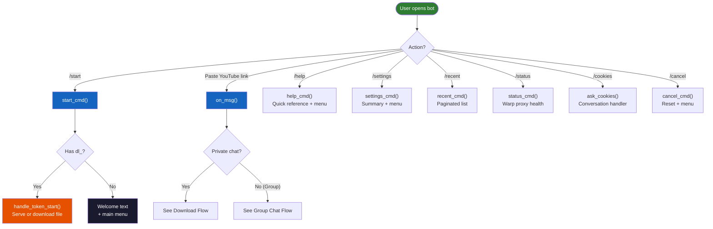

---

## The Main Menu

The **main inline keyboard** is shown after `/start`, `/help`, `/settings`, or when pressing the **🔙 Back** button until reaching the root. It is the central hub for all navigation.

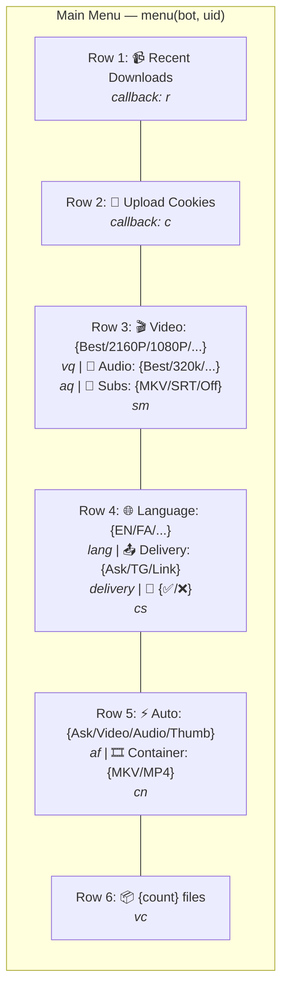

> **Note about 🍪 Upload Cookies**: The `c` callback is **not** dispatched by `router()`. It is intercepted by PTB's `ConversationHandler` registration in `app/__init__.py` before reaching the router. All other callbacks go through the router.

### Button Reference

| Button | Callback | Action |
|--------|----------|--------|
| 📹 **Recent Downloads** | `r` | Opens paginated recent downloads list |
| 🍪 **Upload Cookies** | `c` | Starts `/cookies` conversation handler (intercepted by ConversationHandler, not router) |
| 🎬 **Video: {q}** | `vq` | Opens video quality picker |
| 🎵 **Audio: {q}** | `aq` | Opens audio quality picker |
| 📝 **Subs: {mode}** | `sm` | Opens subtitle mode picker |
| 🌐 **Language: {lang}** | `lang` | Opens subtitle language picker |
| 📤 **Delivery: {mode}** | `delivery` | Opens default delivery method picker |
| 🍪 **{✅/❌}** | `cs` | Shows cookie status (✅ active / ❌ upload needed) |
| ⚡ **Auto: {format}** | `af` | Opens auto-format default picker |
| 🎞️ **Container: {c}** | `cn` | Opens video container picker (Auto/MKV vs MP4) |
| 📦 **{count} files** | `vc` | Shows file count message |

### Dynamic Labels

Several button labels change based on current settings:

- **Video quality**: Shows `Best`, `4K`, `1080p`, `720p`, `480p`, `360p`, or `~` (worst)
- **Audio quality**: Shows `Best`, `320k`, `256k`, `192k`, `128k`, `96k`, or `~` (worst)
- **Subs**: Shows `MKV` (embed), `SRT` (separate), or `Off`. **When MP4 + embed is set**, the effective mode cascades to **SRT** and the label reflects this!
- **Container**: Shows `MKV` (auto) or `MP4` (forced)
- **Cookie**: ✅ green check if cookies are loaded in RAM; ❌ red X otherwise
- **Language**: Shows the 2-letter code in uppercase (EN, FA, AR, RU, ES)

### Router Dispatch

All inline button callbacks flow through a single **`router()`** function in `navigation.py`:

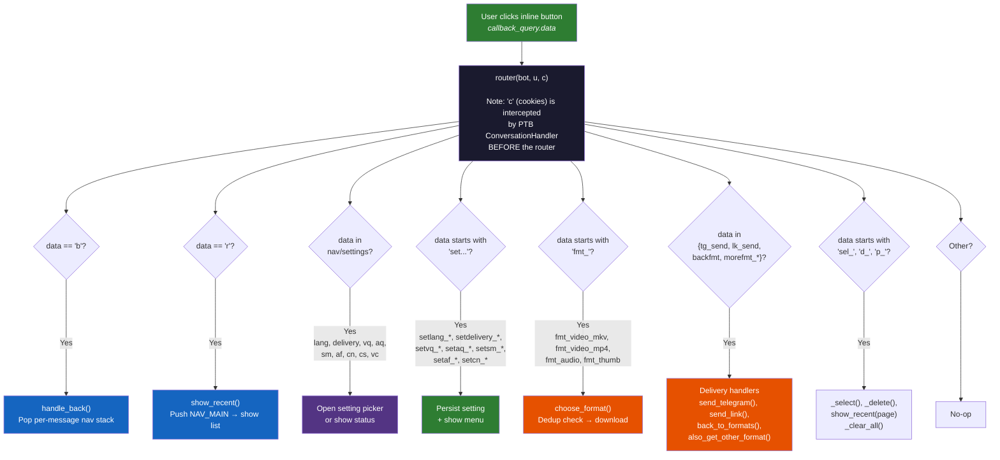

---

## Complete Settings Tree

Every setting follows a **two-step pattern**: a *change* function opens a picker keyboard, and a *set* function persists the choice and returns to the main menu.

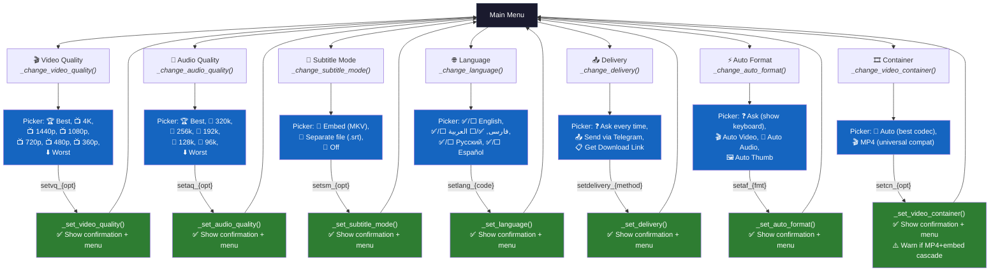

---

## Download Flow

### Overview: From URL to File

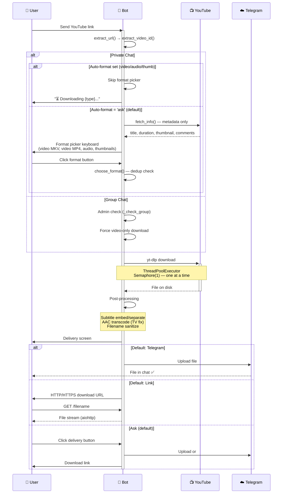

### Format Picker Flow (Private Chat)

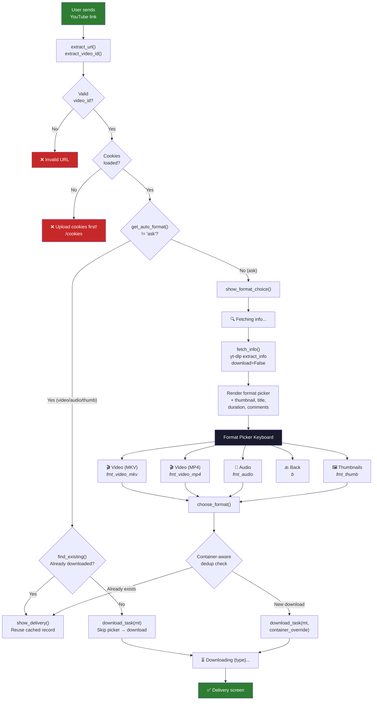

### Format Picker Keyboard (Rendered)

The keyboard shown varies based on what's already downloaded:

| Condition | Button Label |
|-----------|-------------|
| Not downloaded | `🎬 Video (MKV) — best quality + auto-subs` |
| MKV already cached | `✅ 🎬 Video (MKV) - Downloaded` |
| Not downloaded | `🎬 Video (MP4) — universal compat, subs separate` |
| MP4 already cached | `✅ 🎬 Video (MP4) - Downloaded` |
| Not downloaded | `🎵 Audio (MP3)` or `🎵 Audio (M4A)` (no FFmpeg) |
| Audio already cached | `✅ 🎵 Audio - Downloaded` |
| Not downloaded | `🖼️ Thumbnails` |
| Thumbnails already cached | `✅ 🖼️ Thumbnails - Downloaded` |
| (always present) | `🔙 Back` |

> **Note**: Video MKV and MP4 are independently tracked. Having an MKV does NOT mark MP4 as cached — the user might want a fresh MP4 for iOS compatibility.

---

## Delivery Options

After a download completes, the **delivery screen** appears:

### Private Chat Delivery Keyboard

```
📤 Send via Telegram    → Uploads the file to the chat
📋 Get Download Link    → Generates an HTTP/HTTPS URL
🔙 Back to formats      → Re-shows the format picker
➕ 🎵 Audio / 🖼️ Thumb   → "Also get" buttons for other formats
```

### Default Delivery Behavior

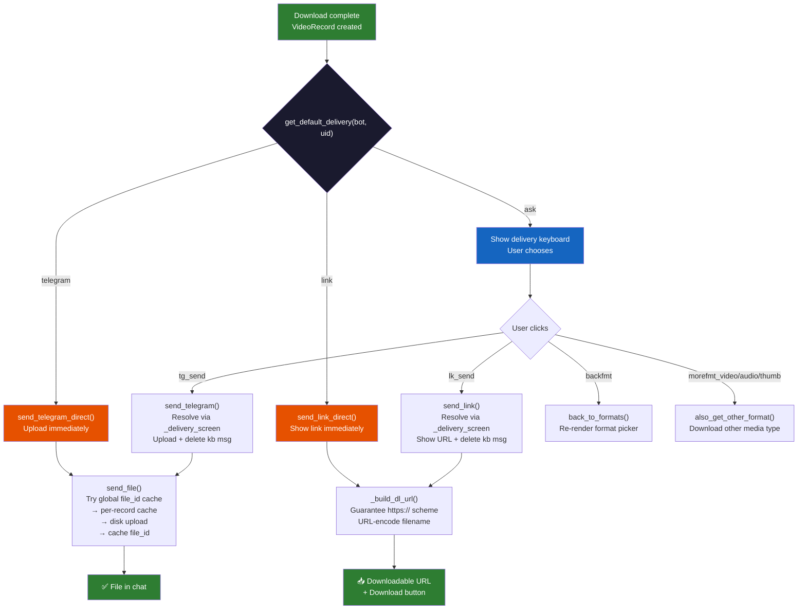

### Unavailable Record Handling

If a delivery keyboard's underlying record is gone (file deleted, server migration):

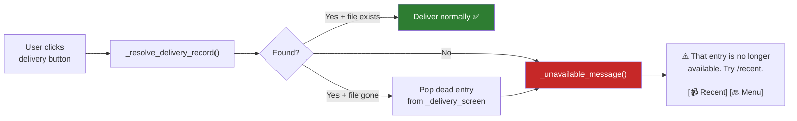

---

## Inline Mode

The bot supports Telegram's **inline query** mode: type `@botname <url>` in **any chat** without adding the bot.

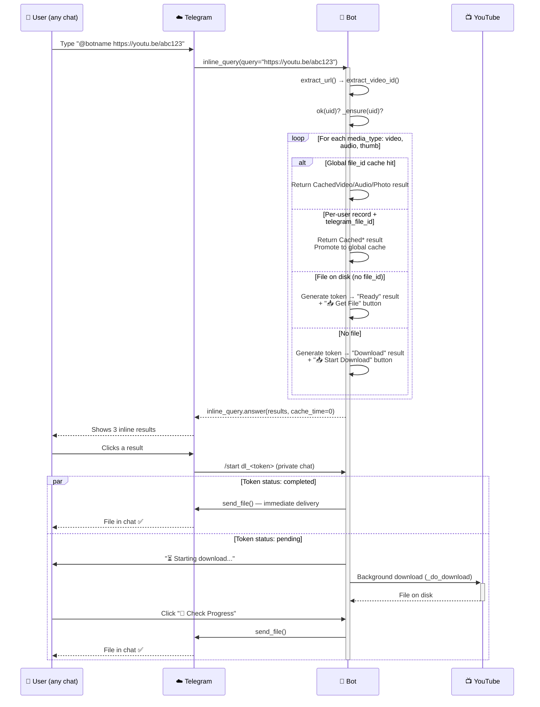

### Inline Result Types

| Status | Result Type | Button | What Happens on Click |
|--------|------------|--------|----------------------|
| **Cached (global)** | `CachedVideo/Audio/Photo` | None (instant) | Telegram sends the cached file directly |
| **Ready** | `Article` with title | `📥 Get File` | Opens `/start dl_<token>` → immediate `send_file()` |
| **Download** | `Article` with title | `📥 Start Download` | Opens `/start dl_<token>` → background download starts |

### Deep Link Token Lifecycle

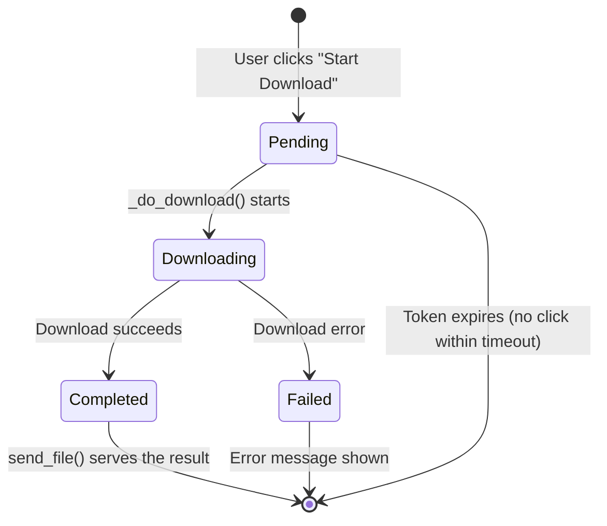

---

## Cookie Upload

The `/cookies` command starts a **ConversationHandler** that accepts a Netscape-format cookies.txt file.

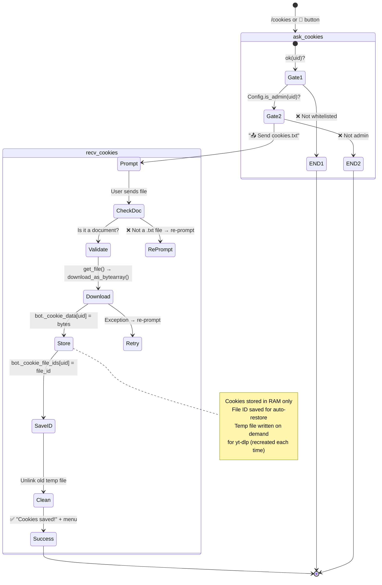

### Cookie Auto-Restore

On bot restart, cookies are automatically restored from Telegram using the saved `file_id`:

```
Bot starts → load_data() → cookie_file_ids loaded from JSON
  → User sends link → _ensure(bot, uid)
    → uid in _cookie_data? No → uid in _cookie_file_ids?
      → Yes → _load_cookies() → bot._bot.get_file(file_id)
        → download_as_bytearray() → bot._cookie_data[uid] = bytes
```

---

## Recent Downloads

The `/recent` command and 📹 button show a **paginated list** (5 entries per page) of the user's last 20 downloads.

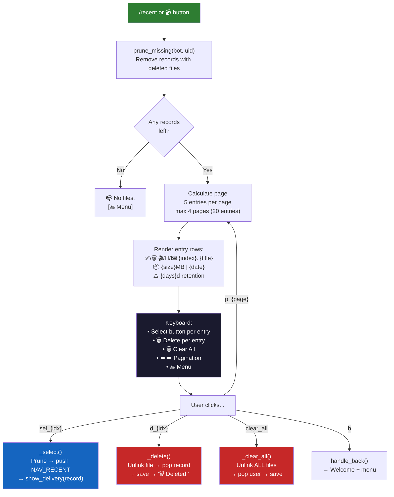

### Page Layout

```
📹 Downloads (1/3)
🗑️ Cleaned 2 missing entries.

✅ 🎬 1. Video Title Here (first 50 chars)
   📦 45.23MB | 2026-07-28 14:30

✅ 🎵 2. Audio Title Here...
   📦 8.12MB | 2026-07-27 09:15

🗑️ 🖼️ 3. Thumbnail (deleted file)
   📦 0.15MB | 2026-07-26 22:00

...

⚠️ 14d retention.

[🎬 1. Title...] [🗑️ #1]
[🎵 2. Title...] [🗑️ #2]
[🖼️ 3. Title...] [🗑️ #3]
[🗑️ Clear All]
[⬅️] [➡️]
[🔙 Menu]
```

---

## Navigation & Back Button

The bot uses a **per-message navigation stack** so that pressing 🔙 **Back** on an old keyboard doesn't confuse it with a new flow.

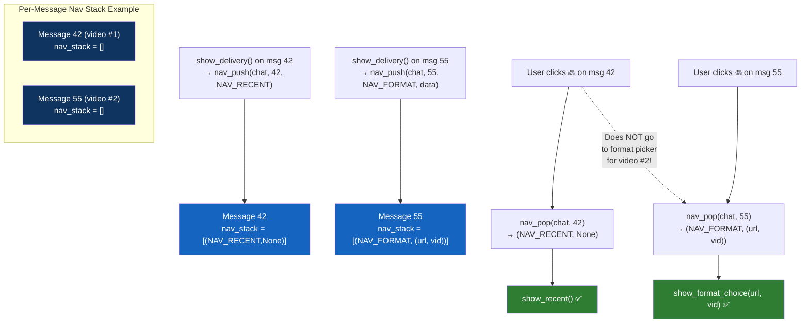

### Navigation Stack Constants

| Constant | Meaning | Push Location |
|----------|---------|--------------|
| `NAV_MAIN` | Return to welcome screen | Menu button in `/recent`, format picker, delivery screen |
| `NAV_RECENT` | Return to recent downloads | Delivery screen (`show_delivery`) |
| `NAV_FORMAT` | Return to format picker | Delivery screen (back to format picker for same video) |
| `NAV_DELIVERY` | Return to delivery screen | (reserved, not yet used) |

### Back Button Resolution

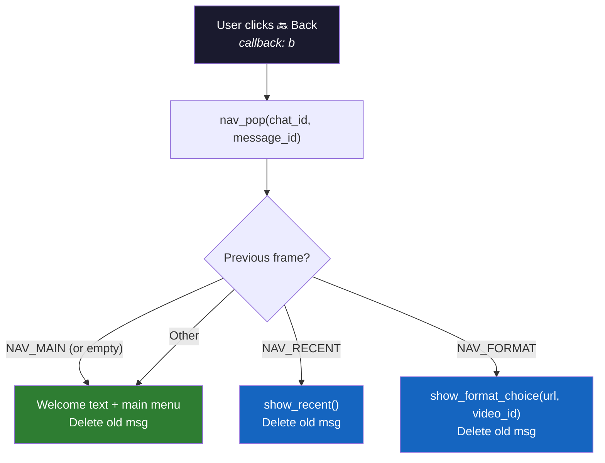

---

## Group Chat Flow

In groups, the bot only downloads **video** (no format choice) and requires an **admin** of the group to be whitelisted.

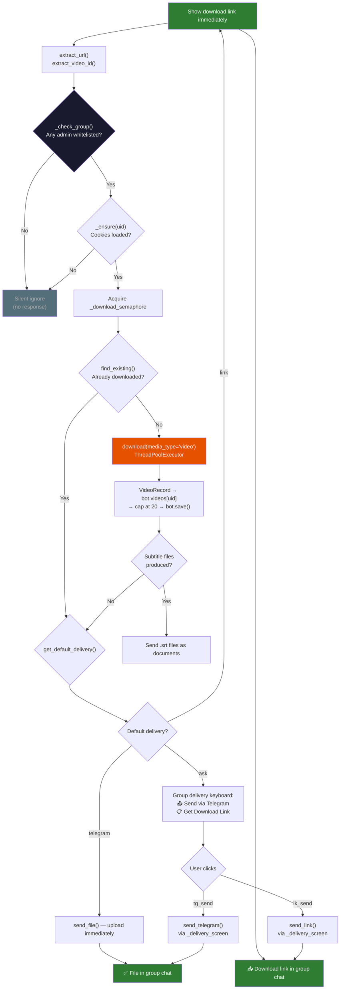

### Group Admin Whitelist

The admin check is **cached per chat_id** after the first successful lookup:

```
_check_group(chat_id):
  1. If chat_id in _group_admins and non-empty → return True
  2. get_chat_administrators(chat_id) via Telegram API
  3. Filter admins: ok(bot, admin.user.id)
  4. Store result set → _group_admins[chat_id]
  5. Return True if any admin matched
```

### Group vs Private Chat Differences

| Feature | Private Chat | Group Chat |
|---------|-------------|-----------|
| Format choice | ✅ Yes (pick Video/Audio/Thumb) | ❌ Video only |
| Auto-format | ✅ Respects user setting | ❌ N/A |
| Delivery keyboard | 📤 Send / 📋 Link / 🔙 Back / ➕ Also get | 📤 Send / 📋 Link only |
| Per-user cookies | ✅ User's own cookies | ✅ Each member uses their own |
| Admin required | ❌ (unless WHITELIST_USERS set) | ✅ Group admin must be whitelisted |

---

## Callback Data Reference

### Main Menu & Navigation

| Callback | Handler | Description |
|----------|---------|-------------|
| `b` | `handle_back()` | Back: pop per-message nav stack |
| `r` | `show_recent()` | Recent downloads list |
| `c` | `ask_cookies()` | Start cookie upload |
| `vc` | (inline) | Show file count |
| `cs` | (inline) | Show cookie status |
| `clear_all` | `_clear_all()` | Delete all user files |

### Settings — Open Picker

| Callback | Handler | Picker |
|----------|---------|--------|
| `vq` | `_change_video_quality()` | Video quality |
| `aq` | `_change_audio_quality()` | Audio quality |
| `sm` | `_change_subtitle_mode()` | Subtitle mode |
| `lang` | `_change_language()` | Subtitle language |
| `delivery` | `_change_delivery()` | Default delivery |
| `af` | `_change_auto_format()` | Auto-format default |
| `cn` | `_change_video_container()` | Container default |

### Settings — Persist Choice

| Callback Pattern | Handler | Example |
|-----------------|---------|---------|
| `setvq_{opt}` | `_set_video_quality()` | `setvq_1080p` |
| `setaq_{opt}` | `_set_audio_quality()` | `setaq_320k` |
| `setsm_{opt}` | `_set_subtitle_mode()` | `setsm_separate` |
| `setlang_{code}` | `_set_language()` | `setlang_fa` |
| `setdelivery_{method}` | `_set_delivery()` | `setdelivery_telegram` |
| `setaf_{fmt}` | `_set_auto_format()` | `setaf_video` |
| `setcn_{opt}` | `_set_video_container()` | `setcn_mp4` |

### Download Flow

| Callback | Handler | Description |
|----------|---------|-------------|
| `fmt_video_mkv` | `choose_format()` | Download video (auto container → MKV) |
| `fmt_video_mp4` | `choose_format()` | Download video (forced MP4) |
| `fmt_audio` | `choose_format()` | Download audio (MP3/M4A) |
| `fmt_thumb` | `choose_format()` | Download thumbnails |

### Delivery

| Callback | Handler | Description |
|----------|---------|-------------|
| `tg_send` | `send_telegram()` | Upload via Telegram |
| `lk_send` | `send_link()` | Generate download link |
| `backfmt` | `back_to_formats()` | Back to format picker |
| `morefmt_video` | `also_get_other_format()` | Also download video |
| `morefmt_audio` | `also_get_other_format()` | Also download audio |
| `morefmt_thumb` | `also_get_other_format()` | Also download thumbnails |

### Recent Downloads

| Callback Pattern | Handler | Description |
|-----------------|---------|-------------|
| `sel_{idx}` | `_select()` | Open delivery for entry at index |
| `d_{idx}` | `_delete()` | Delete entry at index |
| `p_{page}` | `show_recent(page)` | Navigate to page |

---

## Settings Reference Tables

### Video Quality

| Value | Label | yt-dlp behavior |
|-------|-------|----------------|
| `best` | 🏆 Best | Highest available quality |
| `2160p` | 📺 4K | Max height 2160, H.264 forced |
| `1440p` | 📺 1440p | Max height 1440, H.264 forced |
| `1080p` | 📺 1080p | Max height 1080, H.264 forced |
| `720p` | 📺 720p | Max height 720, H.264 forced |
| `480p` | 📺 480p | Max height 480, H.264 forced |
| `360p` | 📺 360p | Max height 360, H.264 forced |
| `worst` | ⬇️ Worst | Lowest available quality |

### Audio Quality

| Value | Label | yt-dlp behavior |
|-------|-------|----------------|
| `best` | 🏆 Best | Highest available bitrate |
| `320k` | 🎵 320kbps | Max 320 kbps |
| `256k` | 🎵 256kbps | Max 256 kbps |
| `192k` | 🎵 192kbps | Max 192 kbps |
| `128k` | 🎵 128kbps | Max 128 kbps |
| `96k` | 🎵 96kbps | Max 96 kbps |
| `worst` | ⬇️ Worst | Lowest available bitrate |

### Subtitle Mode

| Value | Label | Behavior |
|-------|-------|----------|
| `embed` | 🔗 Embed (MKV) | Soft-subs muxed into MKV container. **If container=MP4, cascades to separate!** |
| `separate` | 📎 Separate file | Subtitles delivered as a separate .srt document |
| `off` | 🚫 Off | No subtitles downloaded |

### Subtitle Language

| Value | Label |
|-------|-------|
| `en` | 🇬🇧 English |
| `fa` | 🇮🇷 فارسی |
| `ar` | 🇸🇦 العربية |
| `ru` | 🇷🇺 Русский |
| `es` | 🇪🇸 Español |

### Default Delivery Method

| Value | Label | Behavior |
|-------|-------|----------|
| `ask` | ❓ Ask every time | Show delivery keyboard after each download |
| `telegram` | 📤 Send via Telegram | Auto-upload file to chat |
| `link` | 📋 Get Download Link | Auto-generate HTTP/HTTPS link |

### Auto-Format

| Value | Label | Behavior |
|-------|-------|----------|
| `ask` | ❓ Ask | Show format picker when link is sent |
| `video` | 🎬 Auto Video | Skip picker, download video immediately (respecting container setting) |
| `audio` | 🎵 Auto Audio | Skip picker, download audio immediately |
| `thumb` | 🖼️ Auto Thumb | Skip picker, download thumbnail immediately |

### Video Container

| Value | Label | Behavior |
|-------|-------|----------|
| `auto` | 🔀 Auto | yt-dlp picks best container. Subtitles can be embedded (MKV mux). |
| `mp4` | 🎬 MP4 | Forces MP4 output. Subtitles come as separate .srt files. |

---

## Complete User Journey Map

This diagram shows every possible path a user can take from initial contact through to file receipt:

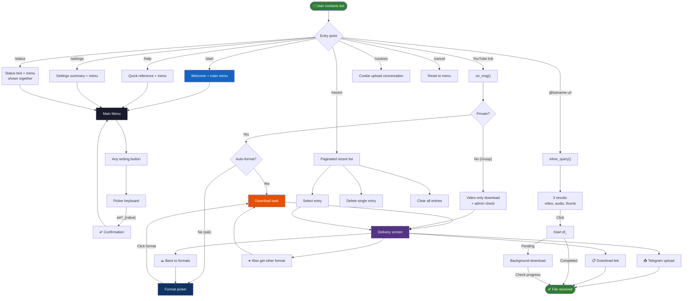

---

### Auto-Delete on Overflow

When a user reaches 21+ downloads, the **oldest record is automatically deleted**:

```
bot.videos[uid].insert(0, record)     # Newest at index 0
while len(bot.videos[uid]) > 20:       # Cap at 20
    old = bot.videos[uid].pop()         # Remove oldest (index 20)
    Path(old.file_path).unlink()        # Delete from disk
bot.save()
```

This means the **last 20 downloads** are always preserved, and older ones are silently removed.

### /cancel in Contexts

- **Normal context**: `/cancel` calls `nav_clear_user()` and returns to main menu with "❌ Cancelled."
- **Inside cookie upload**: `/cancel` returns `ConversationHandler.END` to exit the conversation, then also resets to the main menu
- `/cancel` does NOT affect in-flight downloads — those are handled by the `_download_semaphore`

---

**Next:** [Usage Guide](./USAGE.md) → [Architecture Guide](./ARCHITECTURE.md) → [Configuration Reference](./CONFIGURATION.md)
